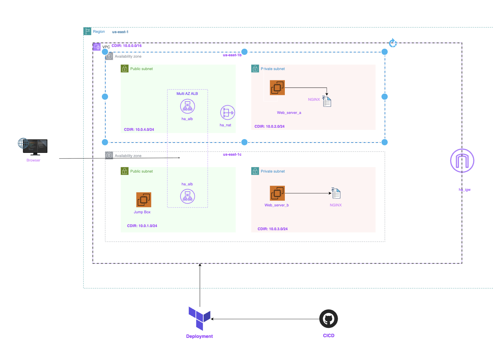
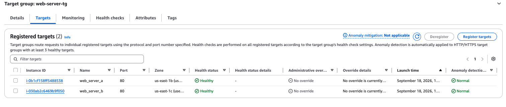
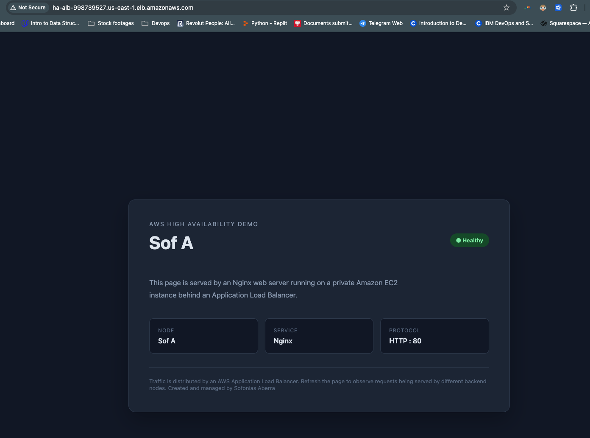
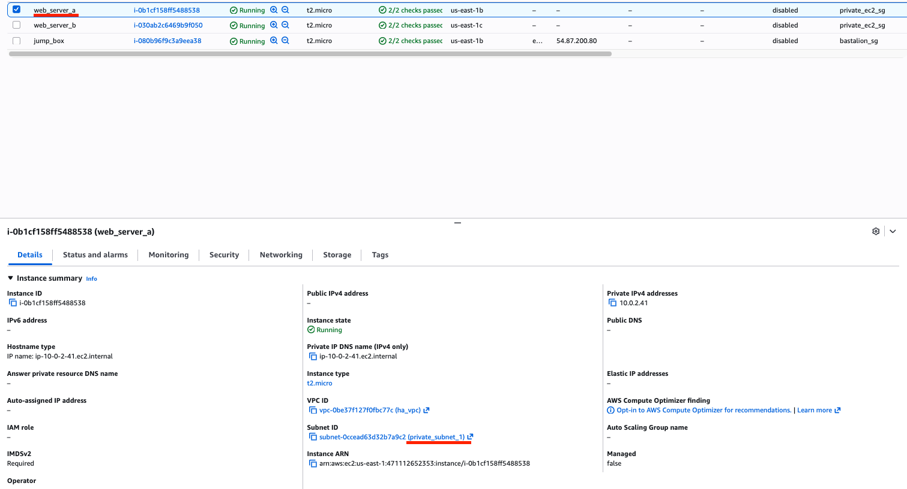
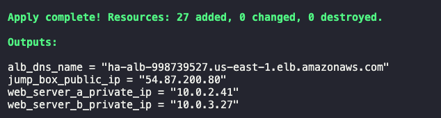

# Highly Available AWS Web Application

## Overview
This project demonstrates a highly available AWS web application deployed using Terraform. The application runs on two EC2 instances distributed across multiple Availability Zones and placed in private subnets. An internet-facing Application Load Balancer distributes HTTP traffic across the healthy instances.

The project focuses on network segmentation, high availability, controlled administrative access, infrastructure as code, and repeatable infrastructure deployment using industry-standard tools.

Git is used as the source of truth for the infrastructure code, while Terraform is used to provision and manage the AWS environment.

## Technologies

- AWS VPC
- EC2
- Application Load Balancer
- NAT Gateway
- Internet Gateway
- Security Groups
- Terraform
- Nginx
- Git
- GitHub Actions


## Architecture


The architecture separates public-facing components from the private application tier while distributing the web servers across multiple Availability Zones.

## Architecture Decisions

### VPC
A dedicated VPC provides an isolated networking environment for the application. It defines the IP address space, subnets, routing, and network boundaries used by the infrastructure.

### Public and Private Subnets
Public subnets host the internet-facing Application Load Balancer, NAT Gateway, and bastion host.

Private subnets host the two EC2 web servers, with each instance deployed in a separate Availability Zone.

This separation prevents the backend instances from being directly reachable from the internet while allowing them to initiate outbound connections through the NAT Gateway.

### Application Load Balancer

An internet-facing Application Load Balancer is deployed across multiple Availability Zones. It receives HTTP traffic from the internet and forwards requests to healthy EC2 instances in the private subnets.

The ALB provides a single public entry point while keeping the backend instances inaccessible directly from the internet.

### EC2

Two EC2 instances are deployed in separate private subnets across two Availability Zones. Each instance runs Nginx and serves HTTP traffic on port 80.

Each server displays its node identity, allowing the ALB's traffic distribution to be observed during testing.

### NAT Gateway

A NAT Gateway is deployed in a public subnet to provide outbound internet connectivity for resources in the private subnets.

The private EC2 instances can use the NAT Gateway to reach external services for activities such as package updates, while remaining inaccessible to unsolicited inbound internet traffic.

### Bastion Host

A bastion host is deployed in a public subnet to provide controlled administrative SSH access to the private EC2 instances.

SSH access to the bastion is restricted to the administrator's public IP address. The private EC2 instances do not require public IP addresses or direct internet-facing SSH access.

The bastion can be removed when administrative access is no longer required.

### Security Groups

Separate security groups are used for the ALB, bastion host, and private EC2 instances.

Traffic is restricted between each layer:
```
Internet     → ALB          : HTTP 80
Admin        → Bastion      : SSH 22
Bastion      → Private EC2  : SSH 22
ALB          → Private EC2  : HTTP 80
```

## Traffic Flow

### Application Traffic

```text
Internet
   ↓
Internet Gateway
   ↓
Application Load Balancer
   ↓
Target Group
   ↓
Private EC2 instances
   ↓
Nginx :80
```
### Private Instance Outbound Traffic
```
Private EC2
   ↓
Private Route Table
   ↓
NAT Gateway
   ↓
Internet Gateway
   ↓
Internet
```
### Adminstrative Traffic
```
Administrator Laptop
   ↓ SSH :22
Bastion Host
   ↓ SSH :22
Private EC2
```
## Infrastructure

```
terraform/
├── provider.tf
├── vpc.tf
├── subnets.tf
├── route_tables.tf
├── security_groups.tf
├── instances.tf
├── alb.tf
├── variables.tf
├── outputs.tf
└── user_data.sh.tpl
```
The infrastructure is defined using Terraform, allowing the entire environment to be created and managed as code.

Terraform variables make the configuration reusable across environments, while outputs expose useful information such as the ALB DNS name and bastion public IP.

```
Note: Environment-specific variable values are not included in the repository. They can be provided through `terraform.tfvars` or supplied at runtime when executing Terraform commands.
```


## Deployment

### Prerequisites

- AWS account
- AWS CLI configured with appropriate credentials
- Terraform installed
- SSH key pairs generated via `keypairGenerator.sh`
- Administrator public IP address configured as a Terraform variable

### Terraform Deployment
To initialize terraform

```
terraform init
```
To format and validate the terraform module syntax
```
terraform fmt
terraform validate
```
To plan and deploy the infrastructure
```
terraform plan
terraform apply
```
## Validation

### ALB Target Group



Both EC2 instances are registered with the ALB target group and report a healthy status.

### Application Served Through the ALB



The application is accessible through the ALB DNS name.

### Private EC2 Instances



Both EC2 instances are deployed without public IP addresses.

### Terraform Deployed


## Security Considerations

### Network isolation

Backend EC2 instances are located in private subnets and do not have public IP addresses. They are not directly reachable from the public internet.

### Restricted SSH

SSH access to the bastion is restricted to the administrator's public IP address, reducing its exposure to unauthorized SSH connections from the internet.

### Security-group-based access

Backend instances only accept HTTP traffic from the ALB and SSH traffic from the bastion.

### Least exposure

The ALB is the public application entry point, while backend infrastructure remains private.

## Limitations

This project is intentionally designed as a learning/demo environment rather than a production deployment.

Current limitations include:

- HTTP is used instead of HTTPS/TLS.
- The ALB is accessed through its AWS DNS name rather than a custom domain.
- Centralized logging and monitoring have not been implemented.
- The NAT architecture uses a single NAT Gateway, which introduces an AZ-level dependency.
- The bastion host is used for administrative access rather than a managed access solution.
### Production Enhancements
For a production environment, potential enhancements would include:

- HTTPS/TLS termination at the ALB using ACM
- Custom domain name using Route 53
- Multi-AZ NAT Gateways to remove the single-NAT dependency
- Centralized logging and monitoring
- IAM roles instead of long-lived credentials
- Automated patch management
- Additional observability and alerting

## Cost Considerations

The architecture includes AWS resources that can incur charges, including:

- Application Load Balancer
- NAT Gateway
- EC2 instances
- Elastic IP addresses
- Data transfer

As this is a learning/demo environment, the infrastructure should be destroyed when it is not being used to avoid unnecessary AWS costs.

## Cleanup
Terraform can be used to remove the infrastructure when the environment is no longer required, helping avoid unnecessary AWS charges.
```
terraform destroy
```